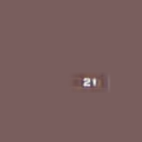
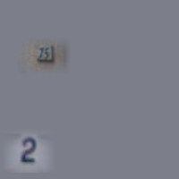

# Towards Semi-Supervised End-to-End Scene Text Recognition

This repository contains the code for the paper: (Insert Name here)[]

# Structure of the repository

The folder `datasets` contains code related to datasets used in the paper.
`datasets/svhn` contains several scripts that can be used to create svhn based ground truth files as used in our experiments reported in section 4.2., please see the readme in this folder on how to use the scripts.
`datasets/fsns` contains scripts that can be used to first download the fsns dataset, second extract the images from the downloaded files and third restructure the contained gt files.

The folder `mxnet` contains all code used for training our networks.

# Installation

In order to use the code you will need the following software environment:

1. Install `python3` (the code might work with python2, too, but this is untested)
2. it might be a good idea to use a `virtualenv`
3. install all requirements with `pip install -r requirements.txt`
4. clone and install `warp-ctc` from [here](https://github.com/baidu-research/warp-ctc.git)
5. go into the folder `mxnet/metrics/ctc` and run `python setup.py install`
6. clone the [mxnet repository](https://github.com/dmlc/mxnet.git)
7. copy the resulting `.so` file from `mxnet/metrics/ctc/build` to `mxnet/metrics/ctc`
8. checkout the tag `v0.9.3`
9. add the `warpctc` plugin to the project by enabling it in the file `config.mk`
10. compile mxnet
11. install the python bindings of mxnet
12. You should be ready to go!

# Training

You can use this code to train models for three different tasks.

## SVHN House Number Recognition

The file `train_svhn.py` is the entry point for training a network using our [purpose build svhn datasets](https://bartzi.de/research/see).
The file as such is ready to train a network capable of finding a single house number placed randomly on an image.

Example:

In order to do this, you need to follow these steps:
1. Download the datasets
2. Locate the folder `generated/centered`
3. open `train.csv` and adapt the paths of all images to the path on your machine (do the same with `valid.csv`)
4. make sure to prepare your environment as described in installation
5. start the training by issuing the following command: `python train_svhn.py <path to train.csv> <path to valid.csv> --gpus <gpu id you want to use> --log-dir <where to save the logs> -b <batch size you want ot use> --lr 1e-5 --zoom 0.5 --char-map datasets/svhn/svhn_char_map.json`
6. Wait and enjoy.

If you want to do experiments on more challenging images you might need to update some parts of the code in `train_svhn.py`. The parts you might want to update are located around line 40 in this file. Here you can change the max. number of house numbers in the image (`num_timesteps`), the maximum number of characters per house number (`labels_per_timestep`), the number of rnn layers to use for predicting the localization `num_rnn_layers` and whether to use a blstm for predicting the localization or not `use_blstm`.

A quite more challenging dataset is contained in the folder `medium_two_digits`, or `medium` in the datasets folder.
Example:

If you want to follow our experiments with svhn numbers placed in a regular grid you'll need to do the following:

1. Download the datasets
2. Locate the folder `generated/easy`
3. open `train.csv` and adapt the paths of all images to the path on your machine (do the same with `valid.csv`)
4. set `num_timesteps` and `labels_per_timestep` to 4 in `train_svhn.py`
5. start the training using the following command: `python train_svhn.py <path to train.csv> <path to valid.csv> --gpus <gpu id you want to use> --log-dir <where to save the logs> -b <batch size you want ot use> --lr 1e-5`
6. If you are lucky it will work ;)

## Text Recognition

Following our text recognition experiments might be a little difficult, because we can not offer the entire dataset used by us.
But it is possible to perform the experiments based on the Synth-90k dataset provided by Jaderberg et al. [here](https://www.robots.ox.ac.uk/~vgg/data/text/#sec-synth).
After downloading and extracting this file you'll need to adapt the groundtruth file provided with this dataset to fit to the format used by our code. Our format is quite easy.
You need to create a `csv` file with tabular separated values. The first column is the absolute path to the image and the rest of the line are the labels corresponding to this image.

To train the network you can use the `train_text_recognition.py` script. You can start this script in a similar manner to the `train_svhn.py` script.

## FSNS

In order to redo our experiments on the FSNS dataset you need to perform the following steps:

1. Download the fsns dataset using the `download_fsns.py` script located in `datasets/fsns`
2. Extract the individual images using the `tfrecord_to_image.py` script located in `datasets/fsns/tfrecord_utils` (you will need to install **tensorflow** for doing that)
3. Use the `transform_gt.py` script to transform the original fsns groundtruth, which is based on a single line to a groundtruth containing labels for each word individually. A possible usage of the `transform_gt.py` script could look like this: `python transform_gt.py <path to original gt> datasets/fsns/fsns_char_map.json <path to gt that shall be generated>`
4. Use the `swap_classes.py` script in `datasets/fsns` and swap the class for `space` and `blank` in the gt, by issuing: `python swap_classes.py <original gt> <swapped gt> 0 133`. This is necessary because MXNet expects the blank label to be `0` for the training with CTC Loss.
5. After performing these steps you should be able to run the training by issuing: `python train_fsns.py <path to generated train gt> <path to generated validation gt> --char-map datases/fsns/fsns_char_map.json --blank-label 0`

# License

This Code is licensed under the GPLv3 license. Please see further details in LICENSE.md.

# Citation

If you are using this Code please cite the following publication:

	TODO
